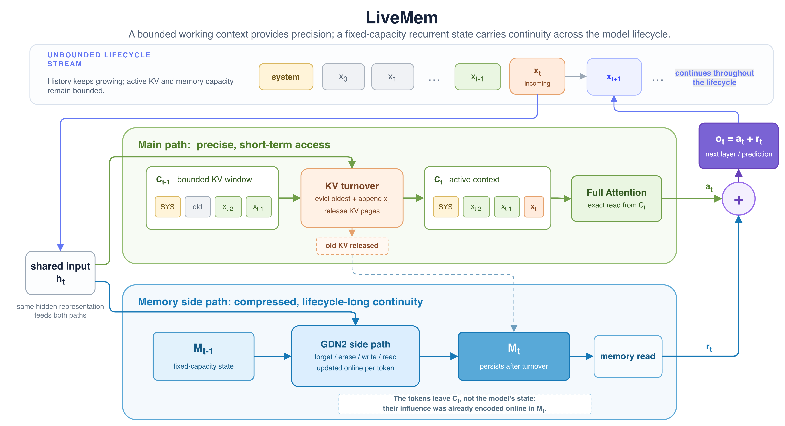
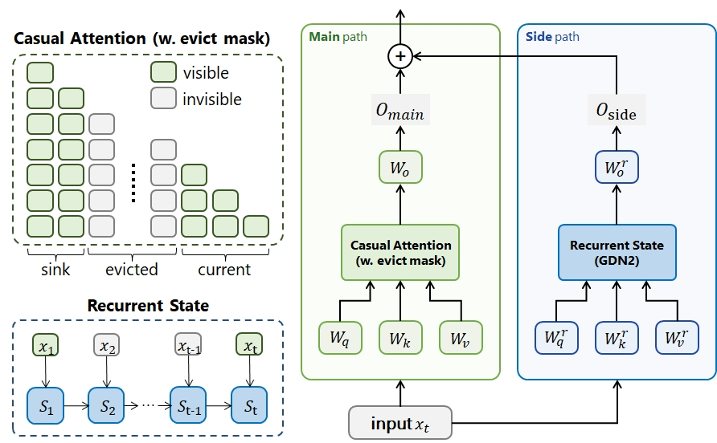

<div align="center">

# LiveMem

**Maintaining Memory State Continuity in Long-Running LLM Inference**

[Paper](https://arxiv.org/pdf/2608.02515) ·
[LiveMem-SFT](https://huggingface.co/chen-l/LiveMem-SFT) ·
[LiveMem-RL](https://huggingface.co/chen-l/LiveMem-RL)

[English](README.md) · 中文



<div align="left">

## LiveMem 简介

长时间运行的助手和 Agent 最终会遇到Context Turnover的情况：工作上下文的容量有限，但模型仍需延续此前的计算状态。LiveMem 将这一能力表述为 **state continuity under context turnover**，即在旧上下文离开 attention window 后，仍通过固定容量的 memory state 延续历史信息。

LiveMem 在预训练 Qwen3 模型的每个 attention layer 上并联一条 Gated DeltaNet-2（GDN2）recurrent memory branch：

- attention 主路保留 system prompt 和最近的有界 KV window，提供精确的短期访问；
- recurrent memory 支路持续读取和更新固定容量的 memory state，覆盖当前 request 的完整生命周期；
- 两条路径的输出在每层直接相加：`o = o_attention + o_memory`；
- 训练时使用动态 attention mask 模拟上下文换出，推理时释放已换出的 KV pages，使训练与部署具有相同的可见性边界；
- memory-oriented SFT 和 RL 让模型在证据离开 attention window 后仍需依赖 memory state 完成任务。



### `state` 与 `truncate`

仓库使用 `mode` 和 `window_size` 描述长历史的处理方式：

| Mode | 历史处理方式 | `window_size` 的含义 |
|---|---|---|
| `state` | 完整历史持续写入 recurrent state；attention 只保留 system sink 与最近窗口 | attention 中保留的 live tokens 数量，当前脚本支持 8K 或 32K |
| `truncate` | 较早历史在送入模型前被丢弃，模型从零 state 处理剩余后缀 | 截断后保留的 memory tokens 数量 |

当前 LiveMem checkpoint 的单次输入仍受 262,144-token positional horizon 限制。LiveMem 的 memory state 在一个 request 内持续维护，请求结束后会被释放；当前 OpenAI-compatible API 不会在两个独立 request 之间自动复用该 state。

## 使用方法

### 1. 准备环境

```bash
pip install -r requirements.txt
pip install -e "third_party/flash-linear-attention[cuda]"
```

### 2. Hugging Face 快速验证

下面的示例显式创建独立的 GDN2 cache，从而在 prefill 和逐 token decode 之间保持 memory state。该路径适合加载模型和功能验证；它不会执行 vLLM 中的 paged-KV window 换出，正式的 `state` window 推理请使用下一节的 vLLM 服务。

```python
import torch

from models import MemoryQwen3ForCausalLM  # 先导入 models，以加载仓库内的 FLA
from fla.models.utils import Cache as FLACache
from transformers import AutoTokenizer

model_id = "chen-l/LiveMem-RL"

tokenizer = AutoTokenizer.from_pretrained(model_id)
model = MemoryQwen3ForCausalLM.from_pretrained(
    model_id,
    dtype=torch.bfloat16,
    attn_implementation="eager",
).eval().to("cuda")

messages = [
    {"role": "system", "content": "You are a helpful assistant."},
    {"role": "user", "content": "Remember that my project codename is Aurora. What is the codename?"},
]
input_ids = tokenizer.apply_chat_template(
    messages,
    tokenize=True,
    add_generation_prompt=True,
    return_tensors="pt",
).to(model.device)

memory_cache = FLACache()
with torch.inference_mode():
    output_ids = model.generate(
        input_ids,
        mem_cache=memory_cache,
        use_cache=True,
        max_new_tokens=128,
        do_sample=False,
    )

print(tokenizer.decode(output_ids[0, input_ids.shape[1]:], skip_special_tokens=True))
```

### 3. 使用 vLLM 提供 OpenAI-compatible API

LiveMem 的 serving plugin 针对 `vllm==0.19.1`。在独立的 vLLM 环境中安装 vLLM、FlashInfer 及仓库插件：

```bash
pip install vllm==0.19.1 flashinfer-python
pip install -e models/vllm
```

启动 32K live attention window 的 `state` 服务：

```bash
CKPT=chen-l/LiveMem-RL \
MODE=state WINDOW_SIZE=32768 \
GPUS=0 PORT=8821 \
bash scripts/serve_livemem.sh
```

请求 OpenAI-compatible endpoint：

```bash
curl http://127.0.0.1:8821/v1/chat/completions \
  -H 'Content-Type: application/json' \
  -d '{
    "model": "memq_state-32k",
    "messages": [
      {"role": "system", "content": "You are a helpful assistant."},
      {"role": "user", "content": "{memory_docs}\n\nSummarize the supplied long history."}
    ],
    "temperature": 0,
    "max_tokens": 512
  }'
```

8K state window 使用 `MODE=state WINDOW_SIZE=8192`。`truncate` 服务可通过 `MODE=truncate WINDOW_SIZE=<tokens>` 启动，但截断由调用端完成：调用端应保留 instruction、query 和生成空间，仅从 memory 的较早一端删除内容，再将最近 `window_size` 个 memory tokens 发送给服务端。

## 复现

下面给出从数据处理、两阶段 SFT、checkpoint 导出、RL 到评估的仓库入口。论文使用 Qwen3 Instruct 作为基座：数据脚本使用 `TOKENIZER_PATH`，导出脚本使用 `QWEN3`，SFT 则可通过 `--set model.qwen3_path=<path>` 指定 Hugging Face ID 或本地路径。下列命令中的 `BASE_MODEL` 表示该基座的 Hugging Face ID 或本地目录。

### 1. 准备训练数据

```bash
export BASE_MODEL="/path/to/qwen3-instruct"

# 下载论文训练集到 dataset/raw/
python scripts/download_datasets.py --group train

# 转换为统一 memory/QA schema
python tools/data_process/run_preprocess.py --group train --jobs 10
python tools/data_process/ttl_assemble.py
python tools/data_process/split.py

# 预 tokenize，并写入 dataset/train/<dataset>/*.arrow
TOKENIZER_PATH="$BASE_MODEL" \
python tools/data_process/tokenize_train.py --nproc 32
```

完整数据清单可用 `python scripts/download_datasets.py --list` 查看。部分评估数据不能由下载脚本自动获取，需要按各数据集许可手动放入 `dataset/raw/`。

### 2. 两阶段 SFT

论文的 SFT 配方使用 2 个节点、每节点 8 张 A800-80GB GPU、BF16 和固定 64K-token packs。每个节点分别设置 `NODE_RANK`、`MASTER_ADDR` 和 `MASTER_PORT`，然后运行相同命令。

Stage 1 在 LongAlign、LongAlpaca、LongMIT 和 Long-Data-Collections 上训练 100 steps：

```bash
PYTHONPATH=. torchrun \
  --nnodes=2 --nproc-per-node=8 \
  --node-rank="$NODE_RANK" \
  --master-addr="$MASTER_ADDR" --master-port="$MASTER_PORT" \
  train/sft/train_sft.py \
  --config train/sft/config/livemem_sft_stage1.yaml \
  --set model.qwen3_path="$BASE_MODEL"
```

Stage 2 从 Stage 1 的 `step_100/trainable.pt` 恢复，在 QA、分类、多问题和长文本混合数据上训练 500 steps：

```bash
PYTHONPATH=. torchrun \
  --nnodes=2 --nproc-per-node=8 \
  --node-rank="$NODE_RANK" \
  --master-addr="$MASTER_ADDR" --master-port="$MASTER_PORT" \
  train/sft/train_sft.py \
  --config train/sft/config/livemem_sft_stage2.yaml \
  --set model.qwen3_path="$BASE_MODEL"
```

若修改了 Stage 1 输出目录，可通过 `--set train.resume_trainable_from=<path>` 覆盖 Stage 2 配置中的恢复路径。显存或节点数量不同的环境可调整配置中的 pack size、梯度累积和训练步数。

### 3. 导出 SFT checkpoint

将完整训练的 memory branch 写回冻结的基座，导出 Hugging Face/vLLM 可加载的完整 checkpoint：

```bash
QWEN3="$BASE_MODEL" \
STEP=outputs/sft/LiveMem-SFT-stage2/step_500 \
OUT=outputs/sft/LiveMem-SFT \
PYTHONPATH=. python tools/export_checkpoint.py
```

`DEVICE=cpu` 可在 CPU 上完成权重导出，但会跳过依赖 Triton 的 forward sanity check。

### 4. RL

先把 RL split 转换为 verl 数据格式：

```bash
TOKENIZER_PATH="$BASE_MODEL" \
python tools/data_process/to_verl_parquet.py
```

仓库提供的 `run_grpo_dev.sh` 是单节点开发/验证入口，使用 GRPO、8 responses/group、无 KL、0.20/0.28 clipping、token-mean loss 和 asynchronous vLLM rollout：

```bash
CKPT=outputs/sft/LiveMem-SFT \
DATA=dataset/train/rl_verl/mix_bal_v1.parquet \
VAL=dataset/train/rl_verl/mix_bal_v1_val.parquet \
RUN=LiveMem-RL CUDA_VISIBLE_DEVICES=0,1 NGPUS=2 STEPS=5 \
bash scripts/rl/run_grpo_dev.sh
```

论文规模使用 2×8 GPU trainer nodes、1×8 GPU rollout node，以及独立的 2-GPU judge 服务。扩展到该规模时，需要将脚本中的 `trainer.nnodes`、Ray cluster 和 rollout/judge 资源映射改为实际集群配置。

### 5. 评估

准备评估数据：

```bash
python scripts/download_datasets.py --group test
python tools/data_process/run_preprocess.py --group test --jobs 8
python tools/data_process/eval_split.py
```

分别启动 `truncate`、`state-32k`、`state-8k` 三个 LiveMem server pool，以及 judge server。以下命令应在不同终端或节点运行：

```bash
CKPT=outputs/sft/LiveMem-SFT MODE=truncate WINDOW_SIZE=262144 GPUS=0 PORT=8811 bash scripts/serve_livemem.sh
CKPT=outputs/sft/LiveMem-SFT MODE=state WINDOW_SIZE=32768 GPUS=1 PORT=8821 bash scripts/serve_livemem.sh
CKPT=outputs/sft/LiveMem-SFT MODE=state WINDOW_SIZE=8192 GPUS=2 PORT=8831 bash scripts/serve_livemem.sh
MODEL=<judge-checkpoint> GPUS=3,4 PORT=8790 bash scripts/serve_judge.sh
```

运行 LiveMem 主评估矩阵：

```bash
SERVERS='{"truncate":"http://127.0.0.1:8811/v1","state-32k":"http://127.0.0.1:8821/v1","state-8k":"http://127.0.0.1:8831/v1"}' \
JUDGE_URL=http://127.0.0.1:8790/v1 \
TOKENIZER_PATH="$BASE_MODEL" \
PY=python \
bash scripts/eval/run_livemem.sh
```

评估支持断点续跑，默认输出到 `results/eval/`。其它 baseline 的 serving 和评估入口位于 `scripts/serve_*.sh` 与 `scripts/eval/run_*.sh`。

### 可选：LoRA 支持

默认的 LiveMem-SFT 和 LiveMem-RL 配方完整训练 recurrent memory branch，并冻结 attention 与 FFN 主路，不使用 LoRA。训练框架同时支持按参数组启用 LoRA；导出工具会自动识别并折叠可选的 LoRA adapter。

## Citation

```bibtex
@article{liu2026livemem,
  title   = {LiveMem: Maintaining Memory State Continuity in Long-Running LLM Inference},
  author  = {Zhichen Liu and Ruihan Sun and Hengjie Yang and Zipeng Wu and Zhaohan Chen and Xiaofan Zhang and Yang Xu},
  journal = {arXiv preprint arXiv:2608.02515},
  year    = {2026}
}
```
